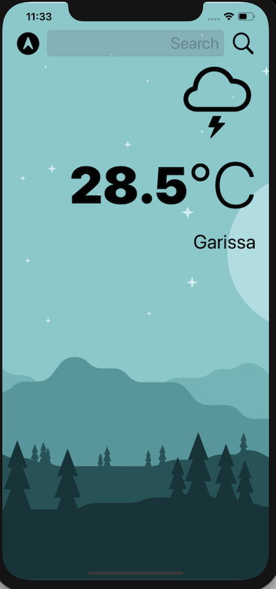
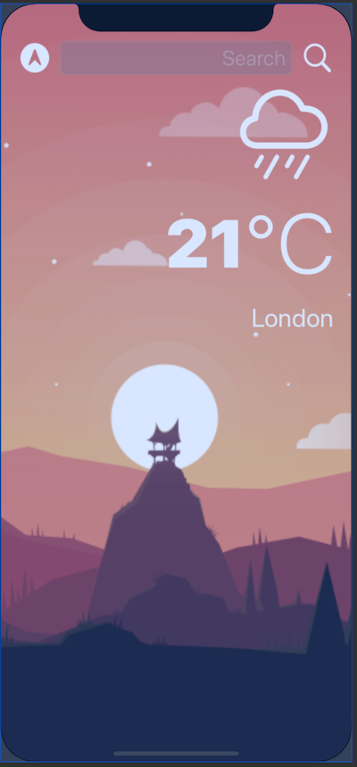

#  Clima

## Description

The Clima app allows you to search for any location and get the weather details of the location. It also includes incorporation of light and dark modes

## Contributors
Raymond Gitonga

## Technologies Used

Swift programming language
CoreLocation 

## Support Or Questions
For any questions feel free to contact me through gitongaraymondd@gmail.com

>This is a companion project to The App Brewery's Complete App Development Bootcamp, check out the full course at [www.appbrewery.co](https://www.appbrewery.co/)

